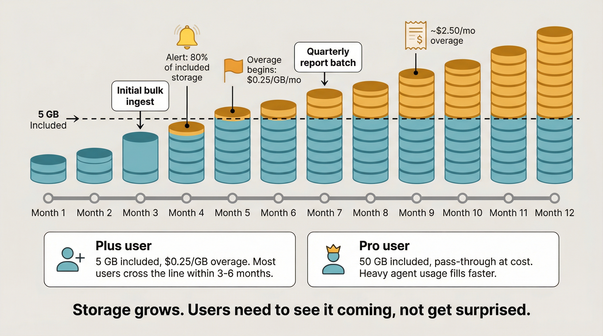
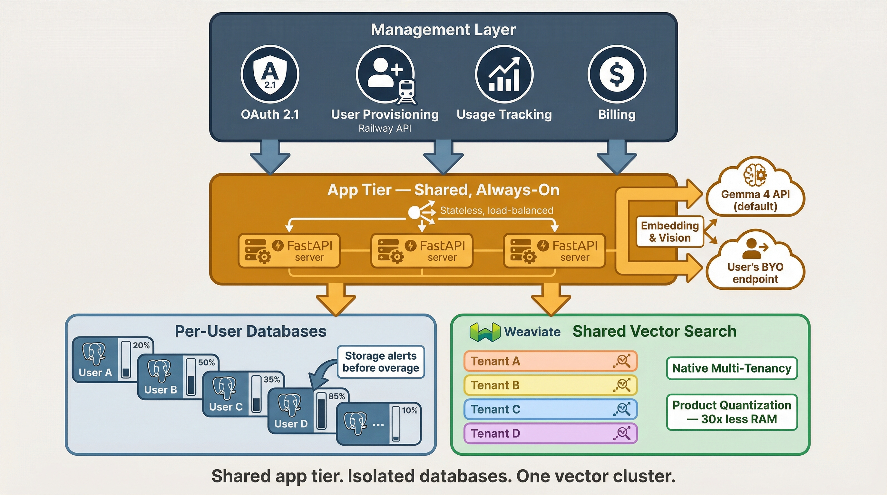

# Ariadne Core — Infrastructure Summary for Engineer Meeting

**Date:** 2026-04-08
**Audience:** Cloud engineering team — what we need built, how it works, what it costs

---

## What Ariadne Core does

Document extraction and retrieval pipeline. Converts PDFs, DOCX, PPTX, etc. into clean Markdown, chunks it, embeds it, stores it, and exposes it via MCP server and REST API. Agents (Claude Code, Cowork, OpenClaw, etc.) search and retrieve extracted documents instead of stuffing raw files into their context windows.

**Why it matters:** The savings come from frontier LLM tokens the user's agent would otherwise burn doing extraction itself. Two real mechanisms, both load-bearing:

1. **Raw PDF bloat in the context window.** A 4,500-word document is **~100,000 tokens as a raw PDF** but only **~5,000 tokens as clean Markdown** — a **20x reduction per document** just from format conversion.
2. **The LLM-driven extraction loop — this is the big one.** Without a pipeline, a frontier model has to figure out extraction itself: write Python in the conversation, call pdfminer, debug table parsing, retry when OCR fails, look at images at frontier vision rates (~$5/M for an Opus-class vision model). **We are using the most expensive possible tokens (~$3–$15/M for frontier-tier reasoning models, Sonnet-class through Opus-class) to do something a very cheap model can do just as well, and a specialized model system can do *better*.** Not just cheaper — *better*. A deterministic pipeline + purpose-built small models capture tables, layout structure, and image semantics more accurately than a frontier model improvising extraction code on the fly.

Our deterministic pipeline replaces both. MarkItDown + format parsers do extraction in pure Python at **$0 in tokens**. A small embedding model (~$0.02/M class) handles text. A small multimodal model (~$0.14/M class) handles images by default — with **BYOM** supported for users who need a more powerful or domain-specific image model. Per-document cost to us: **~$0.002** (derivation: ~5K text tokens × ~$0.02/M + ~3 images × ~5K vision tokens × ~$0.14/M — see `TOKEN_SAVINGS_FRAMING.md`). The frontier model only ever sees clean Markdown via a search interface — and gets *better* extracted content than it would have produced itself.

**Beyond extraction.** Ariadne also adds **semantic embeddings + agent-writable, agent-readable, searchable structured metadata** on top of MarkItDown. Agents inject project names, notes, tags, and entities as JSON; future agents filter, find, and read those notes back without re-extracting the source. Ships in every edition. The more documents a user works with, the more valuable this layer becomes.

**Two audiences feel the savings differently.** Single users on Claude Code / Claude Cowork experience the savings as **runway** — hitting usage limits less often, longer productive sessions. Agentic systems buying tokens directly experience the savings as a **direct line-item cost reduction** on their monthly bill. Same mechanism, different lived experience. Both framings appear in `pro-pricing.md` and the canonical [`TOKEN_SAVINGS_FRAMING.md`](https://github.com/denson/ariadne-core/blob/master/docs/TOKEN_SAVINGS_FRAMING.md). Source for the 20x and 10x figures: Nate Jones, ["Your Claude Sessions Cost 10x What They Should"](https://natesnewsletter.substack.com/p/your-claude-sessions-cost-10x-what).

## Current state: Personal Edition

Open source, self-hosted. Users deploy on Railway, manage their own Postgres, bring their own API keys for embedding and vision models. Works, but users handle everything themselves.

---

## What we're building: Managed Edition

A managed service. Same software, but we handle security, backups, monitoring, and upgrades. Every user gets their own isolated Railway deployment.

### Pricing model

Transparent, no artificial tiers:

| Component | What the user pays |
|-----------|-------------------|
| Management fee | $20/mo — security, backups, monitoring, upgrades, support |
| Railway infrastructure | Pass-through at cost — user picks the instance size they need |
| Tokens (Option A, default) | Pass-through at cost — typically pennies/mo, absorbed by management fee |
| Tokens (Option B) | BYO API keys — $0 token cost to us |

**No feature gates.** Every managed user gets the same software, same multi-agent support, same extraction capabilities. The only variable is how much infrastructure they choose to run. A light user pays ~$25-27/mo total. A heavy user pays more for a bigger instance — but they can see exactly what they're paying for.

### Why per-user databases, not shared

We evaluated shared multi-tenant approaches (RLS on shared Postgres, Snowflake, Citus, Supabase, Neon). All had dealbreakers:

- **Shared Postgres with RLS** — one bad query or one heavy user affects everyone. Security depends on never making a policy mistake. Doesn't scale trust.
- **Snowflake** — 100-400ms latency on simple lookups (it's OLAP, not OLTP). 10-50x more expensive than Postgres for our workload. Wrong tool.
- **Citus** — Azure-specific, specialized skill set to deploy and operate.
- **Supabase** — auth system (GoTrue) is not OAuth 2.1 compliant (no DCR, no client credentials flow). We'd use it as just Postgres and pay for services we don't use.
- **Neon** — serverless architecture means cold starts on database connections. Bad UX for interactive agent queries.

Per-user Railway Postgres is simple, isolated, and we already know how to deploy it. The tradeoff is fleet management overhead — that's where we need engineering help.

---

## Storage: users pay for what they use

Railway charges $0.17/GB for database storage. Every document ingested grows the database — chunks, metadata, search logs. The database does not shrink on its own.

Since infrastructure costs are passed through transparently, users see their storage costs directly. But they still need visibility and alerts:

- Storage dashboard showing current usage and growth trend
- Alerts when storage is growing faster than expected
- Agents need a tool to check storage usage too
- Users must understand their storage is growing before they get a surprise on their Railway bill



**Tiered storage (future):** Active data in the primary database for fast search. Older data moves to bulk/archival storage at reduced cost with higher latency. Distilled summaries of archived documents stay in the primary store. Not needed for launch but the architecture should not prevent us from adding it later.

---

## Vector search: Weaviate

We are not using pgvector. Weaviate is our vector database.

**Why not pgvector:** pgvector's HNSW index requires ~6-8 GB RAM per 1M vectors (1536-dim, no quantization). Weaviate with product quantization uses ~100-200 MB for the same data. That's a 30-40x RAM reduction. pgvector's only advantage was "one fewer thing to deploy" — that's not worth the RAM cost.

**Weaviate deployment:**
- One shared Weaviate cluster serves all managed users
- Native multi-tenancy — each user is a tenant with isolated data
- Product quantization (PQ) for RAM efficiency
- Managed Weaviate Cloud or self-hosted (for Enterprise on-prem)
- Hybrid search (BM25 + vector) built in

**Our code change:** Replace the `VectorStore` pgvector backend with a Weaviate backend. The `VectorStore` protocol is already designed for this — new backend implements existing interface.

---

## Embedding and vision models

We do NOT self-host GPU infrastructure. Two options for users:

**Option A (default): Buy from us.** We route through a managed API provider — text embeddings via a small embedding model (~$0.02/M class — text-embedding-3-small is current default) and image description via a small multimodal model (~$0.14/M class — Gemma 4, Gemini Flash, and similar are current examples). The deterministic pipeline does most of the work in pure code, so token costs are nearly zero (~$0.001–0.003 per document). The management fee absorbs token costs at typical usage; very heavy users see ~$15–20/mo in tokens as a small line item.

**Option B: Bring your own.** Users configure their own API keys and endpoints for any embedding/vision provider. Zero token cost to us.

**Why not self-host:** A small multimodal model via API costs ~$0.14/M tokens (class rate; Gemma 4 31B on Together AI is a current example). Self-hosting on an H100-class GPU (~$3.50/hr) only breaks even at 25M+ tokens per batch at 100% GPU utilization. The API is cheaper, simpler, and has zero idle costs.

---

## Auth: OAuth 2.1

MCP spec mandates OAuth 2.1 for managed services. We need a standards-compliant authorization server supporting:

- **PKCE** (Proof Key for Code Exchange)
- **Dynamic Client Registration (DCR)** — MCP clients register automatically
- **Client credentials flow** — agents authenticate as themselves

**We assume your team has an OAuth 2.1 AS preference** (Ory Hydra, Keycloak, Auth0, or custom). We need it to support the three capabilities above. For Enterprise: SSO/SAML federation via WorkOS or similar in front of the AS.

---

## Does the math work?

### Per-user infrastructure cost (Railway)

| Component | Estimated cost |
|-----------|---------------|
| Postgres instance (small) | ~$5-7/mo |
| Weaviate tenant (shared cluster) | ~$0.50-1/mo marginal |
| App container (shared) | ~$0.20-0.50/mo marginal |
| **Total infrastructure** | **~$6-9/mo** |

### Revenue vs cost

Token costs are nearly zero because the deterministic pipeline does the heavy lifting in pure code. Our margin is the management fee.

| User profile | Revenue | Our cost | Margin |
|-------------|---------|----------|--------|
| Light (~50 docs) | $20 + ~$5 Railway = ~$25 | ~$5 infra + ~$0.10 tokens | **+$20** |
| Moderate (~300 docs) | $20 + ~$5 Railway = ~$25 | ~$5 infra + ~$0.50 tokens | **+$20** |
| Heavy (~1,000 docs) | $20 + ~$10 Railway = ~$30 | ~$10 infra + ~$2 tokens | **+$18-20** |
| Very heavy (~10,000 docs) | $20 + ~$30 Railway + ~$15-20 tokens = ~$65-70 | ~$30 infra + ~$15-20 tokens | **+$0-5** (breakeven on tokens) |
| BYO keys (any volume) | $20 + Railway | infra only | **+$20** always |

**Our margin is the $20 management fee.** Infrastructure is pass-through (Railway costs go directly to the user's bill). Tokens are nearly free because we do extraction in pure code. We make ~$20/user/month for everyone except very heavy Option A users, who break even on tokens until we negotiate provider discounts.

**Path to better margins:** As aggregate token volume grows across all users, we negotiate provider discounts. Pass-through price stays the same; the small spread becomes margin.

### What users save (frontier tokens not burned)

The Revenue vs Cost table above is only the cost side of the story. The bigger number is the frontier-LLM tokens the user's agent does **not** burn because Ariadne replaces the LLM-driven extraction loop. Range = Sonnet-class (~$3/M input) → Opus-class (~$15/M input). Anchor numbers from `TOKEN_SAVINGS_FRAMING.md` (~95K frontier tokens saved per document retrieval).

> **Floor, not ceiling.** The table below counts **Mechanism 1 only** (raw-PDF-to-Markdown 20x × document count). It does **not** include Mechanism 2 (frontier tokens burned on the extraction loop), which is per-session and varies by workflow. Real savings are larger. Numbers are back-of-the-napkin for a *typical* user — if an agent re-opens documents across many sessions, savings are larger; if it ingests once and never revisits, smaller. Full caveats and derivations: [`TOKEN_SAVINGS_FRAMING.md`](https://github.com/denson/ariadne-core/blob/master/docs/TOKEN_SAVINGS_FRAMING.md).

| User profile | Frontier tokens saved/mo | Frontier $ saved/mo (Sonnet → Opus) |
|-------------|--------------------------|--------------------------------------|
| Light (~50 docs) | ~4.75M | **~$15–$70/mo** |
| Moderate (~300 docs) | ~28.5M | **~$85–$430/mo** |
| Heavy (~1,000 docs) | ~95M | **~$290–$1,430/mo** |
| Very heavy (~10,000 docs) | ~950M | **~$2,900–$14,300/mo** |

For agentic systems buying tokens directly (OpenClaw, Open Brain, OB1, custom agents), this is a direct line-item cost reduction. For single users on Claude Code / Claude Cowork (flat-rate frontier subscriptions), the same savings show up as **runway** — hitting usage limits less often, longer productive sessions. Both audiences benefit from the same mechanism.

### What it costs vs DIY (cost side only — pair with savings table above)

| User profile | DIY total | Managed total | Delta |
|-------------|-----------|---------------|-------|
| Light (~50 docs) | ~$5/mo | ~$25/mo | +$20 |
| Moderate (~300 docs) | ~$5–6/mo | ~$25–26/mo | +$20 |
| Heavy (~1,000 docs) | ~$12/mo | ~$32/mo | +$20 |
| Very heavy (~10,000 docs) | ~$50/mo | ~$65–70/mo | +$15–20 |

Same infrastructure line items either way. The +$20 covers managed operations: security setup, automated backups, version upgrades, and monitoring. Users buy back the engineering time they'd otherwise spend on those tasks. We do not claim to be cheaper than DIY on infrastructure — we charge for the work. **Cross-reference the "What users save" table above:** even at the Sonnet floor, a Moderate user saves ~$85/mo in frontier tokens against a +$20/mo cost delta — net ~$65/mo ahead. A Heavy user is an order of magnitude ahead. The +$20 management fee is the smallest number in the comparison once you account for what the user's frontier model would otherwise burn on extraction.

---



## What we need built

1. **Fleet management for Railway Postgres** — automated provisioning, backup, monitoring, and teardown of per-user database instances. This is the core engineering challenge. Railway has a GraphQL API for programmatic instance management.

2. **Weaviate cluster** — deploy and operate a shared Weaviate cluster with native multi-tenancy. Managed Weaviate Cloud or self-hosted.

3. **App container management** — deploy, update, monitor stateless FastAPI containers. Same Docker image, load-balanced across all users. Always-on — no serverless, no cold starts.

4. **OAuth 2.1 server** — your team's preferred AS. Must support PKCE, DCR, and client credentials flow.

5. **API provider routing** — proxy embedding/vision calls to our default provider or the user's BYO endpoint. Track per-user usage for billing ($5/mo included, then pass-through).

6. **Billing integration** — track per-user Railway costs and token usage. The management fee is flat ($20/mo). Infrastructure and token costs are pass-through. Users need visibility into what they're paying for.

7. **Storage visibility** — per-user dashboard showing current storage usage, growth trend. Agents need a tool to check this too.

### What we do NOT need

- GPU infrastructure or model hosting
- Shared/multi-tenant database design (every user gets their own)
- Scale-to-zero or serverless anything — always-on containers and databases
- Any ML ops

The model layer is someone else's API. We just call it.

---

## Architecture

```
Users' MCP Clients (Claude Code, Cowork, etc.)
    │
    ▼ (OAuth 2.1)
┌────────────────────────────────┐
│  Management Layer               │
│  ├── OAuth 2.1 Server           │
│  ├── User Provisioning          │
│  │   └── Railway API ──────────┼──► Create/manage per-user Postgres
│  ├── Usage & Storage Tracking   │
│  └── Billing Integration        │
└────────────────────────────────┘
    │
    ▼
┌────────────────────────────────┐
│  App Tier (shared, always-on)   │
│  ├── FastAPI (MCP + REST)       │  ◄── stateless, load-balanced
│  ├── Extraction Pipeline        │
│  │   ├── MarkItDown (free)      │
│  │   └── API calls ────────────┼──► Gemma 4 API (default)
│  │                              │    or user's BYO endpoint
│  └── Routes to user's DB        │
│      based on auth token        │
└────────────────────────────────┘
    │                │
    ▼                ▼
┌──────────┐   ┌──────────────┐
│ User A's │   │  Weaviate     │
│ Postgres │   │  (shared)     │
├──────────┤   │  ├── tenant A │
│ User B's │   │  ├── tenant B │
│ Postgres │   │  ├── tenant C │
├──────────┤   │  └── ...      │
│ User C's │   └──────────────┘
│ Postgres │
├──────────┤
│ ...      │
└──────────┘
```

### Enterprise — same pattern, different scale

An Enterprise customer deployment is the same architecture deployed for one organization. Employees and agents get individual Postgres instances (or shared within teams, depending on customer needs). Enterprise adds:

- SSO/SAML federation via customer's IdP (WorkOS or similar)
- Cross-user query tools with permissions
- Team and org-level access control
- Custom extraction pipelines

---

## Decisions for this meeting

1. **Railway fleet management** — can we automate provisioning/monitoring of hundreds of small Postgres instances via Railway's API? Or should we use a different platform (Cloud SQL, RDS, Azure Flexible) that has better fleet tooling? What does your team operate today?

2. **Weaviate deployment** — managed Weaviate Cloud or self-hosted? What's your preference?

3. **OAuth 2.1 AS** — what does your team already use? We need PKCE + DCR + client credentials.

4. **App container hosting** — Railway containers? Cloud Run (always-on with min instances)? ECS? What's your team's comfort zone?

---

## Future: Graph representations

Not in scope for initial version. Current focus is security and multi-tenancy with extraction + vector search only.

When we get there: hypergraph tables (`hyperedges` + `hyperedge_members`) in the same relational database — no separate graph DB needed. Standard relational patterns, no exotic extensions.

---

## Reference docs

| Document | What it covers |
|----------|---------------|
| `roadmap/roadmap.md` | Full edition progression plan (5 tiers) |
| `roadmap/pro-pricing.md` | Detailed pricing model with margin analysis |
| `roadmap/cost-analysis-pro-storage.md` | Storage and infrastructure cost analysis |
| `roadmap/token_pricing_snapshot.md` | API token pricing snapshot (2026-04 — drifts downward over time) |
| `roadmap/token_pricing_snapshot_update.md` | Small-multimodal-model analysis and self-host vs API break-even |
| `SPEC.md` | System specification |
