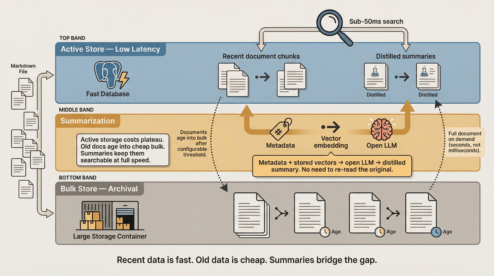
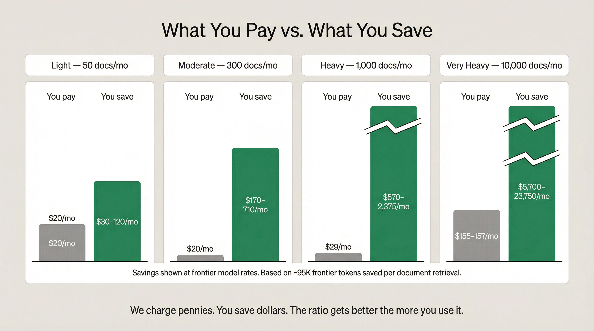

# Managed Edition Pricing Model

**Date:** 2026-04-07
**Status:** Discussion draft

---

## Pricing Philosophy

There are two kinds of token costs in this system, and our pricing story depends on understanding both:


### The two token economies

**1. Our tokens (cheap) — embedding, vision, OCR.** These are the tokens we charge for. We purchase from managed API providers (a small multimodal model at ~$0.14/M — Gemma 4 via Google/Together AI is our current default). The cost per token is low and we include a monthly allowance that covers light-to-moderate usage. This is a line item on the bill only if they exceed the allowance.

**2. Frontier model tokens (expensive) — the tokens Ariadne Core SAVES.** This is the real value proposition. Every document that goes through our pipeline instead of being dragged raw into a Claude/GPT/Gemini context window saves the user 10-100x on frontier model tokens. A raw PDF that costs 100,000+ tokens in a conversation window becomes a 500-token search result. That savings happens on frontier-tier models (~$3–$15/M input, Sonnet-class through Opus-class), not on our small-model embedding tokens (~$0.02/M class). The money saved on frontier model tokens dwarfs everything we charge.

Nate B. Jones covers this in detail — the 8-10x cost reduction is real and measurable. A sloppy session costs $8-10 in frontier compute; a clean session with extracted Markdown costs $1. Across a 10-person team on API: $2,000/month vs $250/month for the same output. Frontier-tier premium models sit in the ~$5/$25 per M in/out range; frontier-tier mid models sit around ~$2/$12 — and the savings from not burning tokens on raw documents stay the same regardless of which tier the user is on. Jensen Huang's $250K/year/engineer figure for token spend makes token management a job skill — and Ariadne Core automates the most impactful part of it.

**Our pricing captures a tiny fraction of the value we create.** A Managed user paying us $20/month management fee + Railway costs + token pass-through might be saving $200-2,000/month in frontier model tokens they never burn. The token savings dashboard (see general_fixes.md) will make this visible so users understand the ROI.

**What this feels like in practice:** A typical user in Claude Cowork or similar agentic environments won't think about token economics. They'll experience it as hitting their usage limits less often. A raw PDF stuffed into a conversation eats context window and burns through rate limits fast. The same document extracted to Markdown and retrieved via search uses a fraction of the tokens — so the user gets more done before they hit any wall. Fewer "you've reached your limit" interruptions, longer productive sessions, more work per dollar of frontier subscription.

### The three billing components

1. **Management fee ($20/mo)** — covers security, backups, monitoring, upgrades
2. **Railway infrastructure** — passed through at cost; user picks their instance size
3. **Storage** — scales with actual usage because storage costs are monotonic (they only go up)
4. **Token charges** — Pass-through at cost. Nearly zero in practice (~$0.001–0.003/doc) because the deterministic pipeline does extraction in pure code. Absorbed by the management fee at typical usage. Or users bring their own model API keys and pay nothing to us for tokens.

Management fee plus pass-through infrastructure and usage-based storage and tokens. No per-document limits. No per-query limits. No feature gates — every Managed user gets the same software. The management fee covers our work; infrastructure and usage pricing ensures costs track what users actually consume.

---

## Component 1: Management Fee

**$20/mo** — covers security, backups, monitoring, and upgrades regardless of usage. This is our margin. Every Managed user pays this; it covers our work maintaining the service.

## Component 2: Railway Infrastructure (Pass-Through)

Railway costs are passed through at cost. The user picks their instance size — we don't mark up infrastructure.

**Actual Railway costs (April 2026):**

| Resource | Railway cost | Notes |
|----------|-------------|-------|
| Disk storage | ~$0.17/GB/mo | Minimal for small-medium workloads |
| Egress | $0.05/GB | Negligible for our use — even heavy users generate <30MB/mo in search results |
| Compute (app container) | Usage-based | ~$5/mo for a small container |
| Postgres (provisioned) | Usage-based | ~$5-10/mo depending on RAM for HNSW index |

Typical per-user Railway cost: ~$10-15/mo at light-to-moderate usage, rising with storage. Users who need more compute can pick a larger instance — they pay Railway's price, not ours.

---

## Component 3: Storage Pricing

Storage grows monotonically — a user who ingests heavily will cost more to serve in month 12 than month 1. A flat fee ignores this reality.

**Included tier + overage**

| Included with management fee | Overage rate |
|----------------------|--------------|
| 10 GB storage | $0.25/GB/month |

Railway charges ~$0.17/GB/mo for raw disk. Our $0.25/GB overage is a modest markup that covers disk + RAM overhead for HNSW vector indexes (~8GB RAM per 1M vectors, which is the real cost driver) + backups + management. Egress ($0.05/GB from Railway) is negligible for our use case and absorbed by the management fee. The goal is too-cheap-to-meter — storage should never be the reason someone hesitates.

What 10 GB gets you:

| Profile | Docs before overage | Approximate timeline |
|---------|-------------------|---------------------|
| Light (~50 docs/mo) | ~10,000 docs | ~15+ years |
| Moderate (~300 docs/mo) | ~10,000 docs | ~3 years |
| Heavy (~1,000 docs/mo) | ~10,000 docs | ~10 months |
| Very heavy (~10,000 docs/mo) | ~10,000 docs | ~1 month |

Light and moderate users will never think about storage. Heavy users hit overage around month 10 — by then the value is obvious and the overage is negligible. Very heavy users hit it within a month but at $0.25/GB it's barely noticeable.

### What counts as storage

- Markdown text (extracted documents)
- Vector embeddings (1536-dim, ~6 KB each)
- HNSW index overhead (~8 GB per 1M vectors)
- Metadata and provenance records

Average document: ~50 KB markdown + ~60-120 KB embeddings (5-20 chunks) = ~100-170 KB per document. 10 GB holds roughly 60,000-100,000 documents before overhead.



### Tiered storage: active vs. bulk

Storage costs are monotonic — but not all stored data needs low-latency access. Documents older than a configurable threshold (e.g., 6-12 months since last access) can move to bulk storage at reduced cost with increased retrieval latency.

| Storage tier | Latency | Cost | What's stored |
|-------------|---------|------|---------------|
| Active (low-latency) | Sub-50ms search | Full rate ($0.25/GB overage) | Recent documents, vectors, HNSW index |
| Bulk (archival) | Seconds to retrieve | Reduced rate (TBD — significantly less than active) | Full document markdown, vectors, metadata |

**Distilled summaries stay in the active store.** When a document moves to bulk, we generate a condensed summary and keep it in the low-latency store with its semantic vectors. We do this efficiently by combining the stored metadata and semantic vectors we already have and feeding them to an open LLM — no need to re-read the original document.

Users search against summaries at full speed. If they need the original full document, it's retrieved from bulk storage on demand (seconds, not milliseconds). For most search-and-retrieve workflows, the summary is sufficient — the user or their agent only pulls the full document when they need the exact text.

**Why this matters for pricing:** Without tiered storage, a heavy user's costs grow forever. With it, active storage eventually plateaus as older documents age into bulk. A heavy user who ingests 1,000 docs/month might have 12,000 docs in active storage (recent 12 months) and 24,000 in cheap bulk (months 13-36). Their active storage cost stabilizes instead of growing linearly.

---

## Component 4: Token Charges

### The core value proposition

> The full framing for this section lives in [`ariadne-core/docs/TOKEN_SAVINGS_FRAMING.md`](https://github.com/denson/ariadne-core/blob/master/docs/TOKEN_SAVINGS_FRAMING.md). The summary below uses the anchor numbers from that doc verbatim.

**The savings come from frontier LLM tokens the user would otherwise burn doing extraction itself.** Two real mechanisms, both load-bearing:

1. **Raw PDF bloat in the context window.** A 4,500-word document is **~100,000 tokens as a raw PDF** but only **~5,000 tokens as clean Markdown** — a **20x reduction per document** just from format conversion. Every one of those raw-PDF tokens hits at the frontier rate.
2. **The LLM-driven extraction loop — this is the big one.** Without a pipeline, a frontier model has to figure out extraction itself: write Python in the conversation, call pdfminer, debug table parsing, retry when OCR fails, look at images at frontier vision rates (~$5/M for an Opus-class vision model). **We are using the most expensive possible tokens (~$3–$15/M for frontier-tier reasoning models, Sonnet-class through Opus-class) to do something a very cheap model can do just as well, and a specialized model system can do *better*.** Not just cheaper — *better*. A deterministic pipeline + purpose-built small models capture tables, layout structure, and image semantics more accurately than a frontier model improvising extraction code on the fly.

**Our deterministic pipeline replaces both.** MarkItDown plus format-specific parsers extract documents in pure Python at **$0 in tokens**. A small embedding model (~$0.02/M class) chunks and embeds the text. A small multimodal model (~$0.14/M class — Gemma 4, Gemini Flash, and similar are current examples) describes images by default — and **BYOM is supported** if a user needs a more powerful image model or one that performs better on their particular content (medical imaging, engineering schematics, handwritten forms, etc.). **Per-document cost to us at default: ~$0.002** (derivation: ~5K text tokens × ~$0.02/M + ~3 images × ~5K vision tokens × ~$0.14/M — see `TOKEN_SAVINGS_FRAMING.md` for the full chain). The frontier model only ever sees clean Markdown via a search interface — and gets *better* extracted content than it would have produced itself.

**Beyond extraction — the Ariadne layer over MarkItDown.** Token savings on extraction are the headline number, but Ariadne also adds **semantic embeddings + agent-writable, agent-readable, searchable structured metadata** on top of MarkItDown's extraction. Agents can inject project names, notes, tags, and entities as JSON; future agents can filter, find, and read those notes back without re-extracting the source. This ships in **every edition, including Personal**. We don't put a hard dollar value on it, but **the more documents a user works with, the more valuable it becomes.** Token savings make it cheap to ingest a lot of documents; the embeddings + metadata layer makes a large corpus useful instead of overwhelming.

**Two audiences feel the savings differently.** Single users on Claude Code / Claude Cowork (flat-rate frontier subscriptions) experience the savings as **runway** — hitting their usage limits less often, longer productive sessions, more work per day before they get rate-limited. Agentic systems buying tokens directly (OpenClaw, Open Brain, OB1, custom agents) experience the savings as a **direct line-item cost reduction** on their monthly bill, predictable per document volume. Both audiences benefit from the same mechanism — they just feel it differently.

**Nate Jones's punchline (the 10x):** A wasteful 30-turn session — raw PDFs in context, Opus for everything, conversation sprawl — runs **$8–$10**. The same work done cleanly — markdown-first, model-appropriate routing — runs **~$1**. Same outcome, 1/10 the spend. Source: ["Your Claude Sessions Cost 10x What They Should"](https://natesnewsletter.substack.com/p/your-claude-sessions-cost-10x-what).

### Two options for embedding and vision models

Managed users choose how they want to handle extraction models:

**Option A: Buy from us (default).** We route through our API providers — a small embedding model (~$0.02/M class) for text and a small multimodal model (~$0.14/M class) for image description. We pass through our costs at whatever rate we're paying. Users don't have to think about it — it just works, and token costs are absorbed by the management fee at typical usage.

**Option B: Bring your own.** Users configure their own API keys for embedding and vision models in their settings. Want to use a cheaper model? A more powerful one? A specialized fine-tune? Go ahead. Their API calls go directly to their provider — zero cost to us, zero impact on our margins.

Either way, the extraction pipeline is the same. Only the model endpoint changes.

### Option A details: buy from us

| Component | Details |
|-----------|---------|
| Included | All extraction token costs absorbed by the management fee at typical usage |
| Default models | A small embedding model (~$0.02/M class — text-embedding-3-small is current default) for text; a small multimodal model (~$0.14/M class — Gemma 4 / Gemini Flash and similar) for image description |
| Per-document cost | ~$0.001–0.003 (text embedding ~$0.0001 + image description ~$0.001–0.003 only when images are present) |
| Margin now | Tiny — basically breakeven with a small spread from volume discounts |
| Margin at scale | As we buy more volume, we negotiate provider discounts. Pass-through pricing stays the same, the spread becomes a small token margin |

**Why we don't mark up tokens:** Token costs are nearly zero anyway. Marking them up would mean fighting over fractions of a dollar while making the product feel less honest. We charge a flat management fee for the work we actually do (security, backups, upgrades) and pass through the trivial token costs at our rate. Volume discounts give us a small margin without changing what users pay.

**Realistic token costs by volume:**

| Profile | Docs/mo | Token cost/mo | Notes |
|---------|---------|---------------|-------|
| Light | ~50 | ~$0.10 | Rounding error |
| Moderate | ~300 | ~$0.50 | Still rounding error |
| Heavy | ~1,000 | ~$2 | Negligible |
| Very heavy | ~10,000 | ~$15-20 | Real but small compared to hosting |

The management fee easily absorbs these for everyone except very heavy users, where token costs become a visible (but still small) line item alongside hosting.

### Option B details: bring your own models

Users configure their own API keys and endpoints in their Managed settings:

```yaml
extraction:
  provider: custom
  embedding_endpoint: https://api.together.xyz/v1/embeddings
  embedding_api_key: ${TOGETHER_API_KEY}
  vision_endpoint: https://api.openai.com/v1/chat/completions
  vision_model: gpt-5
  vision_api_key: ${OPENAI_API_KEY}
```

**Why users might choose this:**
- **Cheaper models:** Together AI serves open embedding models at ~$0.01/M. If extraction quality is sufficient for their docs, they save money.
- **More powerful models:** GPT-5 vision ($1.25/M) or Gemini 3.1 Pro ($2/M) may extract better from complex documents. Worth it if the documents are high-value.
- **Specialized models:** A fine-tuned model for medical/legal/financial documents.
- **Privacy requirements:** Route through a provider they already have a data processing agreement with.

**Why this is good for us:**
- Zero token cost for BYO users. Their API calls go to their provider, not ours.
- We still charge the $20 management fee.
- No risk — we can't lose money on tokens we don't buy.
- Users who experiment with BYO and find our default is good enough come back to Option A.

### Current provider landscape (snapshot: 2026-04)

> Specific vendor rates shown here are a snapshot — they drift on quarterly cycles in **only one direction in this market: down**. Prices essentially never go up; vendors compete by dropping rates as inference hardware improves. The snapshot is useful for BYOM orientation; don't treat any single row as load-bearing to the savings story. The framing doc cites rates by model class for exactly this reason.

| Provider | Embedding | Vision/Multimodal (input) | Notes |
|----------|-----------|--------------------------|-------|
| Gemma 4 31B (Google/Together) | $0.14/M | $0.14/M (same model) | Our default. Natively multimodal. |
| OpenAI text-embedding-3-small | $0.02/M | — | Embedding only, no vision |
| Google Gemini Embedding | $0.15/M | — | Embedding only |
| Together AI (open models) | ~$0.01/M | — | Cheapest embedding option |
| OpenAI GPT-5 | — | $1.25/M | Most capable vision, BYO only |
| Gemini 3.1 Pro | — | $2.00/M | Strong vision, BYO only |
| Gemini 2.5 Flash | — | $0.30/M | Good vision, cheap, BYO only |

### Token margin analysis

Token costs are basically a rounding error at every realistic volume. Our margin is the management fee, not the tokens.

**Option A (buy from us):**

| Scenario | Our cost | Revenue | Margin |
|----------|----------|---------|--------|
| Light to heavy users | $0.10–2/mo | Pass-through | Negligible — absorbed by management fee |
| Very heavy users | ~$15-20/mo | Pass-through | Negligible — absorbed by management fee |
| At scale | Provider volume discounts | Pass-through stays at our public rate | Small spread becomes token margin |

**Option B (BYO):**

| Scenario | Our cost | Revenue | Margin |
|----------|----------|---------|--------|
| All usage | $0 | $0 | No token revenue, but no token cost either |

**Per-user margin check:**

Infrastructure is pass-through (Railway costs go directly to the user's bill). Our revenue is the $20 management fee. Token costs are nearly zero — the management fee easily absorbs them at typical usage.

| User type | Option | Our revenue | Our cost (tokens only) | Margin |
|-----------|--------|-------------|------------------------|--------|
| Light (~50 docs) | A | $20 | ~$0.10 | ~+$19.90 |
| Light (~50 docs) | B | $20 | $0 | +$20 |
| Moderate (~300 docs) | A | $20 | ~$0.50 | ~+$19.50 |
| Moderate (~300 docs) | B | $20 | $0 | +$20 |
| Heavy (~1,000 docs) | A | $20 | ~$2 | ~+$18 |
| Heavy (~1,000 docs) | B | $20 | $0 | +$20 |
| Very heavy (~10,000 docs) | A | $20 | ~$15-20 | ~+$0-5 |
| Very heavy (~10,000 docs) | B | $20 | $0 | +$20 |

**The honest picture:** Token costs are nearly zero because the deterministic pipeline does the heavy lifting in pure code. We make ~$20/user/month on the management fee for everyone except very heavy Option A users, who break even on the management fee alone. As we negotiate provider discounts (even 10-15% off at scale), even very heavy Option A users become profitable. BYO users are always profitable because they cost us nothing beyond the management fee.

**Why no markup:** Marking up token pass-through would add cents to our margin while making the product feel less transparent. The honest framing — "tokens are nearly free, we charge for managed operations" — wins more trust than "we add 20% to your token bill."

---

## The Security Angle

Worth stating but not overselling:

| Provider type | Security | Cost |
|--------------|----------|------|
| Big providers (OpenAI, Anthropic, Google) | Strong — clear data handling policies, SOC 2, enterprise agreements | Premium (~$0.02–$0.15/M embedding-class, ~$0.30–$2/M vision-class — current snapshot) |
| Open model APIs (Together AI, Groq) | Variable — fast and cheap, but your documents go to their infrastructure | Cheap (~$0.01/M embedding-class, ~$0.05/M vision-class — current snapshot) |
| **Us (Managed, Option A)** | **Strong — we select trusted API providers, no data-sharing agreements, documents flow through our managed pipeline** | **$5/mo included, pass-through after** |
| **Us (Managed, Option B)** | **User controls — they pick their provider and their data handling agreement** | **$0 from us (BYO keys)** |

We're not claiming better security than OpenAI. Option A users get our curated provider selection with clear data handling policies. Option B users control exactly where their documents go — if they have an existing DPA with a provider, they can route extraction through that provider directly. Either way, the extracted data lives in our managed Postgres instance under our security controls.

---



## Combined Managed Pricing Example

Examples below assume Option A (buy from us). Option B users pay $0 in token charges to us — their total is just management fee + Railway costs + storage, and they pay their chosen provider directly for embedding/vision tokens.

**Frontier token savings come from replacing the LLM-driven extraction loop, not from cheap vision OCR.** Without this pipeline, an LLM that needs to read a document has to figure out how to extract it itself — write extraction code, call pdfminer, debug table parsing, retry when OCR fails, navigate inconsistent layouts. A single LLM-driven extraction session burns 50K–200K frontier tokens at ~$3–$15/M (Sonnet-class through Opus-class) — roughly $0.25 to $3.00 per session at current rates. A heavy user runs many of these per day. Our deterministic pipeline does that work in pre-written Python for $0 in tokens, then a small embedding model and a small multimodal model handle the rest.

> **Read the savings tables as a floor, not a ceiling.** The "frontier tokens saved" and "frontier $ saved" rows below count **Mechanism 1 only** — the raw-PDF-to-Markdown 20x reduction times document count. They do **not** include Mechanism 2 (the frontier-tokens-burned-on-extraction-loop savings), which is per-session and varies wildly by workflow. Real savings including Mechanism 2 are larger. The tables are also back-of-the-napkin for a *typical* user — if your agent re-opens the same document across many sessions, savings are larger; if it ingests once and never revisits, smaller. You know which you are. Anchor numbers and full caveats: [`TOKEN_SAVINGS_FRAMING.md`](https://github.com/denson/ariadne-core/blob/master/docs/TOKEN_SAVINGS_FRAMING.md).

### Light user (~50 docs/mo)

| Component | Monthly cost |
|-----------|-------------|
| Management fee | $20 |
| Railway infrastructure (small instance) | ~$5 |
| Storage (well under 10 GB) | $0 (included) |
| Tokens (~50 docs × ~$0.002) | ~$0.10 |
| **Total they pay us** | **~$25/mo** |
| Frontier tokens saved/mo (~50 × ~95K) | ~4.75M |
| **Frontier $ saved/mo (Sonnet → Opus)** | **~$15–$70/mo** |

DIY equivalent: ~$5/mo hosting + ~$0.10/mo tokens + their time. They're paying us ~$25/mo — about $20 more than DIY — for managed operations and never having to think about it. **For agentic systems buying tokens directly, that ~$15–$70/mo of frontier tokens they don't burn shows up as a direct cost reduction. For single users on Claude Code / Cowork, the same savings show up as more runway before they hit usage limits.**

### Moderate user (~300 docs/mo)

| Component | Monthly cost |
|-----------|-------------|
| Management fee | $20 |
| Railway infrastructure (small instance) | ~$5 |
| Storage (well under 10 GB for years) | $0 (included) |
| Tokens (~300 docs × ~$0.002) | ~$0.50 |
| **Total they pay us** | **~$25–26/mo** |
| Frontier tokens saved/mo (~300 × ~95K) | ~28.5M |
| **Frontier $ saved/mo (Sonnet → Opus)** | **~$85–$430/mo** |

DIY equivalent: ~$5/mo hosting + ~$0.50/mo tokens. Managed is ~$20 more for the same line items plus operations. **At this volume, an agentic system buying tokens directly recovers the management fee many times over in frontier tokens not burned. A single user on Claude Code / Cowork experiences this as fewer rate-limit interruptions across hundreds of document interactions per month.**

### Heavy user (~1,000 docs/mo)

| Component | Monthly cost |
|-----------|-------------|
| Management fee | $20 |
| Railway infrastructure (medium instance) | ~$10 |
| Storage (hits 10 GB around month 10) | $0 for first ~10 months |
| Tokens (~1,000 docs × ~$0.002) | ~$2 |
| **Total they pay us** | **~$32/mo** |
| Frontier tokens saved/mo (~1,000 × ~95K) | ~95M |
| **Frontier $ saved/mo (Sonnet → Opus)** | **~$290–$1,430/mo** |

DIY equivalent: ~$10/mo hosting + ~$2/mo tokens = ~$12/mo. Managed is ~$20 more — the flat management fee. **At heavy volume the frontier savings dwarf everything we charge — an agentic system saves an order of magnitude more in tokens than it pays us for managed operations. A single Claude Code / Cowork user at this volume effectively gets a much bigger subscription than they paid for.**

### Very heavy user (~10,000 docs/mo)

| Component | Monthly cost |
|-----------|-------------|
| Management fee | $20 |
| Railway infrastructure (larger instance) | ~$30 |
| Storage (hits 10 GB around month 3) | $0 → growing |
| Tokens (~10,000 docs × ~$0.002) | ~$15–20 |
| **Total they pay us** | **~$65–70/mo** |
| Frontier tokens saved/mo (~10,000 × ~95K) | ~950M |
| **Frontier $ saved/mo (Sonnet → Opus)** | **~$2,900–$14,300/mo** |

DIY equivalent: ~$30/mo hosting + ~$15–20/mo tokens = ~$50/mo. Managed is ~$20 more. Users at this scale should also consider the Team tier where costs amortize across the group. **At very heavy volume the frontier savings are 50–200x what they pay us in management fees. For an agentic system buying tokens directly, this is a five-figure annual line-item reduction. For a Claude Code / Cowork user, this is the difference between hitting weekly limits constantly and never thinking about them.**

---

## The Honest Cost Comparison

There are two sides to this story and both belong on the page. Side one: Managed is never cheaper than DIY in raw infrastructure dollars — it's always DIY + ~$20/mo for managed operations. Side two: that comparison ignores the **frontier tokens the user's LLM no longer has to burn doing extraction itself**, which is by far the biggest line item once you account for it.

### Side 1 — What you pay us (infrastructure + management fee)

| Profile | DIY total | Managed total | Delta |
|---------|-----------|---------------|-------|
| Light (~50 docs/mo) | ~$5 | ~$25 | +$20 |
| Moderate (~300 docs/mo) | ~$5–6 | ~$25–26 | +$20 |
| Heavy (~1,000 docs/mo) | ~$12 | ~$32 | +$20 |
| Very heavy (~10,000 docs/mo) | ~$50 | ~$65–70 | +$15–20 |

The flat $20/mo management fee covers security setup, automated backups, version upgrades, and monitoring. Users who would otherwise spend hours on these tasks get that time back. Users who enjoy running their own infrastructure should pick DIY — the codebase is open source and the hosting is the same.

### Side 2 — What you save in frontier tokens (the bigger number)

Same profiles, this time showing frontier-LLM tokens the user does **not** burn because Ariadne replaces the LLM-driven extraction loop. Range = Sonnet-class (~$3/M input) → Opus-class (~$15/M input), Mechanism 1 only — floor, not ceiling.

| Profile | Frontier tokens saved/mo | Frontier $ saved/mo (Sonnet → Opus) |
|---------|--------------------------|--------------------------------------|
| Light (~50 docs/mo) | ~4.75M | **~$15–$70/mo** |
| Moderate (~300 docs/mo) | ~28.5M | **~$85–$430/mo** |
| Heavy (~1,000 docs/mo) | ~95M | **~$290–$1,430/mo** |
| Very heavy (~10,000 docs/mo) | ~950M | **~$2,900–$14,300/mo** |

For agentic systems buying tokens directly, that's a direct line-item reduction on the monthly frontier bill. For single users on Claude Code / Claude Cowork, the same savings show up as **runway** — hitting usage limits less often, longer productive sessions, more work per day. Both audiences benefit from the same mechanism; they just feel it differently.

### The combined picture

| Profile | Cost delta vs DIY | Frontier $ saved/mo | Net (Sonnet floor) |
|---------|-------------------|----------------------|---------------------|
| Light | +$20 | $15–$70 | break-even to **−$50** |
| Moderate | +$20 | $85–$430 | **−$65 to −$410** |
| Heavy | +$20 | $290–$1,430 | **−$270 to −$1,410** |
| Very heavy | +$15–20 | $2,900–$14,300 | **−$2,880 to −$14,285** |

*Negative numbers are savings. Even at the Sonnet floor, Moderate users come out ahead by 3x; Heavy users by an order of magnitude.*

The pitch is simple and honest: same infrastructure line items as DIY, plus $20/mo for the work we do so you don't have to — and you stop burning frontier tokens on extraction your LLM was never the right tool for in the first place.

The crossover gets even better for us as we scale — more users means higher aggregate token volume means better negotiating position with API providers. Pass-through pricing stays the same for users; the gap between what we pay providers and what we charge becomes profit. And since we buy API tokens (not GPU capacity), there are zero idle costs while we build that user base.

> Anchor numbers and the full derivation: [`ariadne-core/docs/TOKEN_SAVINGS_FRAMING.md`](https://github.com/denson/ariadne-core/blob/master/docs/TOKEN_SAVINGS_FRAMING.md). Source for the 20x and 10x figures: Nate Jones, ["Your Claude Sessions Cost 10x What They Should"](https://natesnewsletter.substack.com/p/your-claude-sessions-cost-10x-what).

---

## Open Questions

1. **Annual discount** — offer 2 months free on annual billing? Standard play, improves cash flow predictability.
2. **Free trial** — how long? 14 days? 30 days? First 1,000 documents free?
3. **Bulk storage pricing** — what's the right rate for archival tier? Needs to be cheap enough to incentivize keeping data vs. deleting, but not so cheap we're subsidizing indefinite storage.
4. **BYO model validation** — do we validate that BYO embedding models produce compatible vector dimensions? Or let the user deal with the consequences of switching models mid-stream?
5. **Volume discount threshold** — at what aggregate token volume can we negotiate provider discounts? Need to estimate total monthly volume across all Managed users to set realistic timeline for when pass-through becomes profitable.
