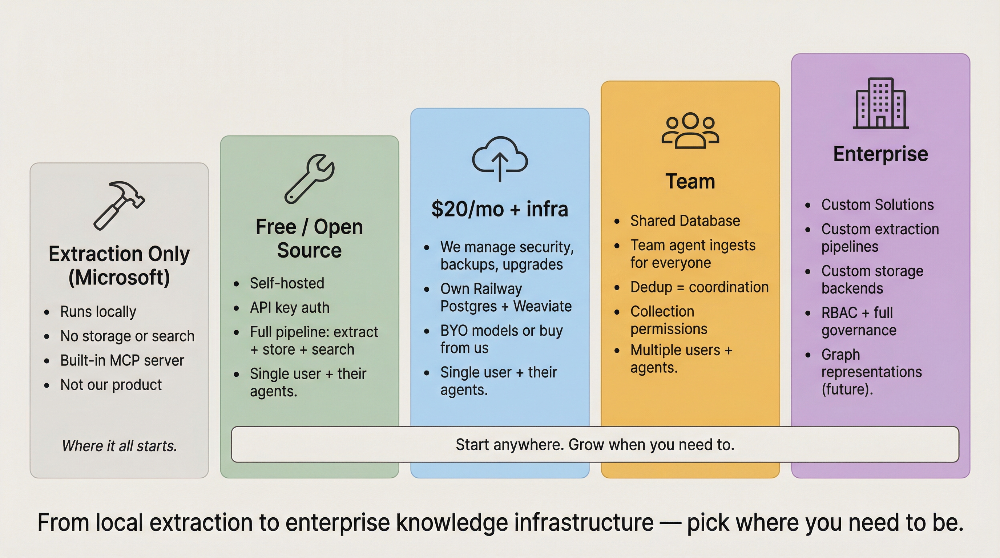
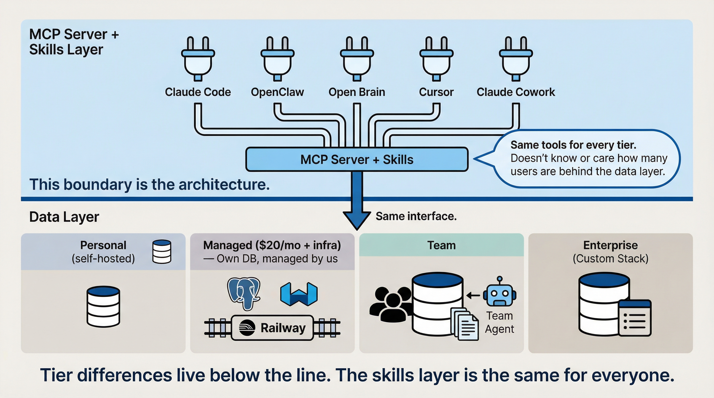
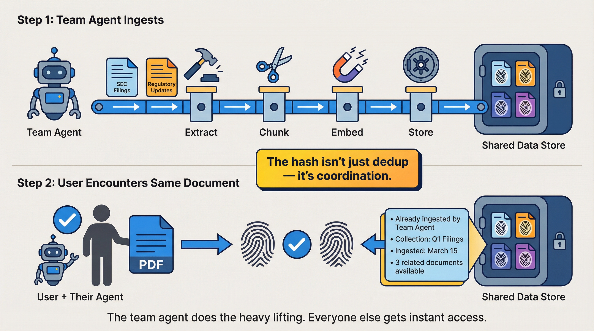
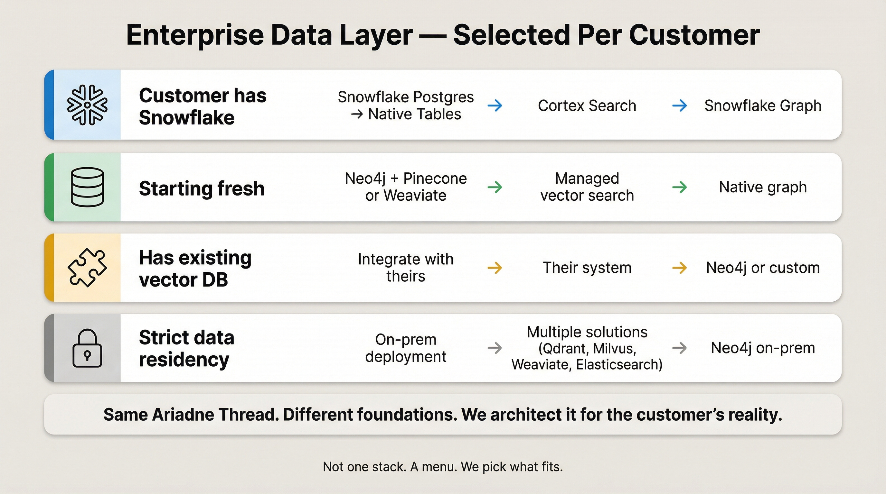
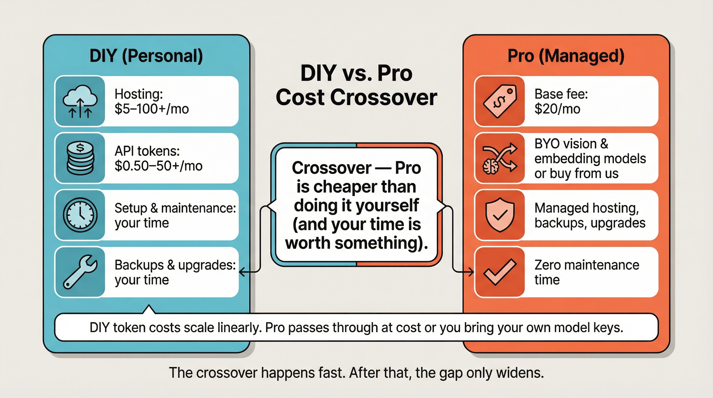
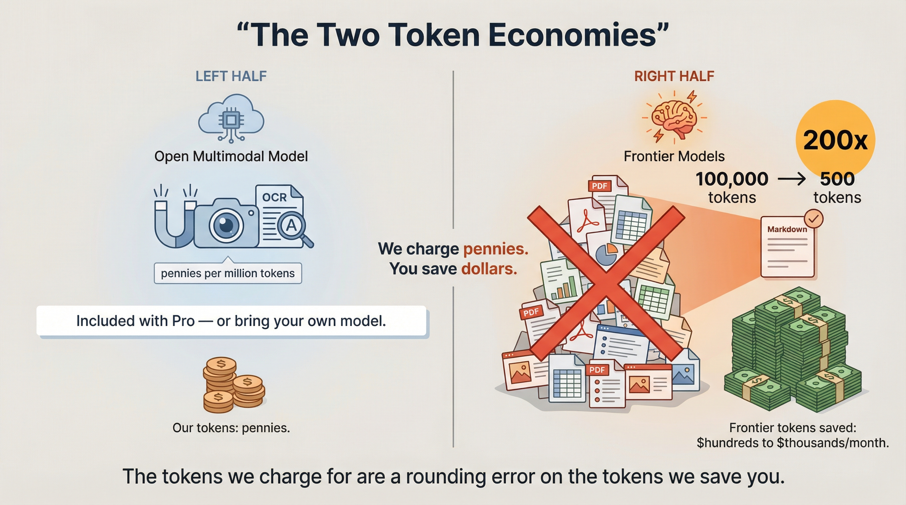

# Ariadne Core — Edition Progression Plan

## Context

Ariadne Core Personal Edition exists and works. The next step is planning the progression from Personal → Managed → Team → Enterprise, where each tier adds capabilities that unlock value for increasingly complex knowledge work — not headcount-based feature gating.



Tier positioning:
- **MarkItDown:** Extraction only, no storage/search — Microsoft's open source tool, not ours, but a valid starting point
- **Personal:** Free, self-hosted, single user — full pipeline (extract + store + search + retrieve)
- **Managed:** $20/mo management fee + Railway infrastructure at cost. We handle security, backups, monitoring, upgrades. User picks their instance size.
- **Team:** Multiple humans + agents sharing a common database with coordinated ingestion
- **Enterprise:** Large or complex workloads, stack-agnostic, full governance

Key design inputs:
- **Value-based tiers:** A 50-person VLSI team benefits more than a 500-person real estate office. Tiers track task complexity, not org size.
- **Enterprise is stack-agnostic:** Snowflake, Neo4j + Pinecone/Weaviate, or customer's existing platform. Not locked to any vendor.
- **Extraction strategy:** MarkItDown stays as the fast/free base. Open source Unstructured was evaluated and rejected (MarkItDown performed better alone). For Managed: purchase embedding/vision tokens from managed API providers (Gemma 4 family via Google/Together AI) — cheaper and simpler than self-hosting. Or BYO model keys. For Enterprise: Unstructured enterprise API as a component for complex docs (scanned PDFs, table-heavy, OCR), with custom wrappers for pairwise/hypergraph representations on top.
- **One codebase, feature flags:** All tiers from the same repo, controlled by config + license key.


- **Separation of concerns:** Data storage and retrieval is one layer. The MCP server and skills are another. The workflow is the same at every scale — ingest, deduplicate, chunk, embed, store, search, retrieve. What changes between tiers is who shares the database, how they authenticate, and what extraction/enrichment capabilities are available. The MCP server/skills layer doesn't care how many users are behind the data layer.
- **Open source philosophy:** We expect the community will build workarounds for Personal edition limitations — OAuth, alternative vector stores, custom extraction. We encourage this. The architecture is designed to be extensible (`VectorStore` protocol, `APIKeyStore` protocol, extraction router). Paid tiers offer managed reliability and security for the same capabilities, not artificial feature gates. If you can do it without us, go for it.

## The Tiers

### MarkItDown (exists, not ours)

**Who:** Anyone who just needs document extraction without storage, search, or retrieval. This is Microsoft's open source tool — it comes with its own MCP server built in. We don't support it, but it's a legitimate option and we should acknowledge it.

| Aspect | Details |
|--------|---------|
| Infrastructure | Runs locally, no server needed |
| Auth | None |
| Storage | None — extraction only, no persistence |
| Extraction | MarkItDown (20+ formats to Markdown) |
| Search/Retrieval | None |
| MCP Server | Built into MarkItDown |

This is what Ariadne Core uses under the hood for extraction. If all you need is to convert documents to Markdown and feed them directly into your context window, MarkItDown alone does the job. Ariadne Core adds everything else — chunking, embedding, storage, search, dedup, provenance.

---

### Personal (exists today)

**Who:** Anyone who wants the full pipeline — extraction plus storage, search, and retrieval — and is willing to run it themselves. Free, open source, extensible.

| Aspect | Details |
|--------|---------|
| Infrastructure | Self-hosted (Railway/Fly.io/Docker) |
| Auth | Single API key, in-memory store |
| Multi-tenancy | None (org_id placeholder fields exist but unenforced) |
| Data | Postgres + pgvector |
| Extraction | MarkItDown only (free, 20+ formats) |
| Vision/Enrichment | External API (OpenAI, Gemini, etc.) — optional |
| Governance | Provenance tracking (document_interactions, search_log) |

The architecture is intentionally extensible. Want to set up OAuth yourself? Swap in Pinecone instead of pgvector? Add SSO? The `VectorStore`, `APIKeyStore`, and extraction protocols are designed for this. The community will push the Personal edition beyond what we ship — we encourage it.

**Personal users get the same frontier token savings as Managed users.** The pipeline is identical — pre-written deterministic Python (MarkItDown + format-specific parsers) extracts each document for $0 in tokens, then a cheap embedding model and a cheap vision model handle the rest. The frontier model in your agent never has to figure out how to parse a PDF, write extraction code, or debug OCR retries. It just sees clean Markdown via search.

Two real mechanisms drive the savings, and both apply to Personal users from day one:

1. **Raw PDF bloat collapses by ~20x.** A 4,500-word document is ~100,000 tokens as a raw PDF but only ~5,000 tokens as clean Markdown. Every retrieval saves **~95,000 frontier tokens** that would otherwise hit at frontier-tier reasoning rates (~$3–$15/M, Sonnet-class through Opus-class).
2. **The LLM-driven extraction loop disappears entirely.** Without this pipeline, your agent burns frontier tokens writing pdfminer code, debugging table parsing, retrying OCR, and looking at images at frontier vision rates. With it, that work happens in pre-written Python at $0 in tokens — and the deterministic pipeline is often *better* at tables and structure than a frontier model improvising extraction on the fly.

A Personal user pays ~$5/mo to Railway for hosting and a few cents per month in token costs. The frontier savings (which they don't pay us for) are typically ~$15–$1,430/mo depending on volume — see `pro-pricing.md` for the full table. Anchor numbers and the canonical framing live in [`ariadne-core/docs/TOKEN_SAVINGS_FRAMING.md`](https://github.com/denson/ariadne-core/blob/master/docs/TOKEN_SAVINGS_FRAMING.md).

The token savings dashboard (see general_fixes.md) works on Personal too. As their savings grow, it becomes a natural signal for when upgrading makes sense:

- **Savings are high but time spent on maintenance is growing?** → Consider Managed. We handle it for you.
- **Savings are high and the system is running fine?** → Stay on Personal. Invest time in extending it — better extraction, custom vector stores, whatever serves your workflow.
- **Savings are low because you're not processing enough documents?** → You might not need Ariadne Core at all yet. MarkItDown alone might be enough for now.

The dashboard helps users make informed decisions about their own setup rather than pushing them toward a tier they don't need.

---

### Managed (build next)

**Who:** Anyone who wants the full pipeline without managing infrastructure themselves. Could be a light user processing 20 docs/month who doesn't want to deal with Railway and Postgres backups, or a heavy user ingesting thousands of documents whose agentic system needs reliable extraction.

Could they set all this up themselves on the Personal edition? Yes. The infrastructure costs are similar. What Managed buys is our time instead of theirs — we handle security, backups, upgrades, monitoring, and troubleshooting.

**Implementation approach:** We designed the system. For the Managed edition infrastructure, we're partnering with a local firm with a strong track record of standing up secure data stores with APIs to help implement and operate it.

**Pricing:** $20/mo management fee + Railway infrastructure at cost (pass-through). User picks the instance size they need. Token costs are nearly zero (~$0.001–0.003 per document) and absorbed by the management fee at typical usage. Or BYO model keys for $0 token cost to us. No feature gates — every managed user gets the same software.

**Delta from Personal:**

| Component | Change |
|-----------|--------|
| Auth | OAuth 2.1 only. MCP clients use OAuth natively (spec mandates it). No separate API key system. Pre-approved scripts execute through the agent's OAuth session, not independently. |
| Extraction | MarkItDown + extraction router + OCR engine |
| Models | Two options: (A) Buy from us — we route through managed API providers (default is a small multimodal model, ~$0.14/M class — Gemma 4 via Google/Together AI is the current default), $5/mo included, pass-through at cost after. (B) Bring your own — users configure their own embedding/vision API keys for any provider they want. |
| Hosting | Managed by us on Railway. We deploy, maintain, update, back up. Each user gets their own Postgres instance. |
| Vector search | Weaviate (shared cluster, user's own tenant). Replaces pgvector — 30-40x less RAM per vector. |
| Storage | Railway costs passed through transparently. User sees exactly what they pay for infrastructure. |

**Extraction strategy for Managed:**
- MarkItDown remains the fast default for text-native docs
- Extraction router selects engine based on document analysis
- Default: OCR and vision via a small multimodal model API (natively multimodal — embedding, vision, and OCR from one model at ~$0.14/M class; Gemma 4 is the current default). $5/mo included, pass-through at cost after.
- Alternative: users configure their own embedding/vision API keys — any provider, any model. Zero token cost to us.
- Provider switching is a config change, not an architecture change — we (or the user) move to whoever offers the best price/performance

**Key files to change/create:**

| # | Component | Files | Size |
|---|-----------|-------|------|
| 1 | Feature flags + licensing | New `features.py`, `licensing.py` | M |
| 2 | OAuth 2.1 authorization server | New `api/oauth.py` — token issuance, PKCE, DCR, client credentials flow | L |
| 3 | Replace API key auth with OAuth token validation | `api/auth.py` — validate Bearer tokens, remove API key logic | M |
| 4 | Extraction router | New `extraction/router.py` | M |
| 5 | OCR/vision extraction | New `extraction/ocr.py` | M |
| 6 | Model provider config | `config.py` — default API endpoints + BYO model configuration (user-supplied API keys and endpoints) | S |
| 7 | Weaviate backend | New `storage/weaviate.py` — implements `VectorStore` protocol | L |

**Build order:** 1 → 2 → 3 → 4 → 5,6,7

---

### Team (future, builds on Managed)

**Who:** A group of humans and their agents sharing a common database. Two grad students working on a paper. A car dealership. General Motors. The workflow is the same — only the scale is different.

**The Team workflow:**

The key difference from Personal/Managed is shared state. A **team agent** ingests documents relevant to everyone into the shared data store — SEC filings, regulatory updates, research papers, specs, whatever the group needs. It maintains updates as new versions come out.

When an individual user (or their agent) encounters a document and sends it for ingestion, the hash detects it's already in the system. Instead of re-processing, it informs the user and feeds them the relevant metadata — when it was ingested, by whom, what collection it's in, what's changed since they last looked at it.

This means the dedup system isn't just an efficiency optimization — it's a **coordination mechanism**. The team agent does the heavy lifting. Individual users get instant access to what's already been processed, with full provenance.



**Delta from Pro:**

| Component | Change |
|-----------|--------|
| Auth | OAuth 2.1 + identity provider integration (Okta, Azure AD, Google Workspace, or whatever the group uses). Same OAuth system as Managed, federated through the group's IdP. |
| Shared database | Multiple users + agents reading/writing the same Postgres instance. Data isolation via collections + permissions, not separate databases. |
| Team agent | A persistent agent that ingests and maintains documents for the group — monitoring sources, updating changed documents, organizing collections. |
| Access control | Collection-level permissions — who can read/write which collections. Some collections are shared, some are personal. |
| Dedup as coordination | Hash match returns existing document metadata + provenance to the requesting user instead of re-processing. |
| Audit | Who ingested what, who searched what, who accessed what. Immutable log. |

**Key files to change/create:**

| # | Component | Files | Size |
|---|-----------|-------|------|
| 1 | Users + permissions schema | New migration `00X_team.sql` | M |
| 2 | Request context | New `pipeline/context.py` — `RequestContext` threaded through stores | M |
| 3 | Identity provider integration | New `api/identity.py` | L |
| 4 | Collection permissions | Modify `dedup.py`, `pgvector.py` — permission-aware queries | M |
| 5 | Dedup coordination response | Modify dedup to return rich metadata on hash match (who ingested, when, which collection) | M |
| 6 | Audit log | New `pipeline/audit.py` + migration | M |
| 7 | Team agent framework | Agent configuration for persistent ingestion/monitoring | L |

**Critical design decision:** `RequestContext` must be optional (None = Personal/Managed behavior). Lower tiers must not break.

---

### Enterprise (future, custom solutions)

**Who:** Organizations with large or complex workloads where the Team tier's standard extraction and storage aren't sufficient. Financial services, healthcare, defense, pharma, large engineering firms, or any org with specialized document types that require custom processing.

**Enterprise is not locked to any stack.** Each deployment is architected for the customer's needs. We select from a menu of components based on what they already have, what their documents look like, and what their governance requires.



**Data layer options (selected per customer):**

| If customer has... | Data layer | Vector search | Graph/relationships |
|-------------------|-----------|---------------|-------------------|
| Snowflake | Snowflake Postgres → native tables + Cortex Search | Cortex Search (hybrid + neural reranking) | Snowflake graph features or external |
| Nothing specific | Neo4j + Pinecone or Weaviate | Pinecone/Weaviate (managed vector search) | Neo4j (native graph) |
| Existing vector DB | Integrate with what they have | Customer's existing system | Neo4j or custom |
| Strict data residency | On-prem deployment | Multiple solutions (Qdrant, Milvus, Weaviate, Elasticsearch — selected per requirements) | Neo4j on-prem |

**Snowflake path (when customer already has Snowflake):**
- Phase 1: Snowflake Postgres (lift-and-shift, zero code changes, pgvector compatible)
- Phase 2: Native Snowflake tables + Cortex Search + Hybrid Tables
- Phase 3: Snowpark Container Services (app runs inside Snowflake, zero data movement)
- Phase 4: Snowflake Horizon governance (PII discovery, RLS, lineage, SOC 2/HIPAA/FedRAMP)

**Extraction strategy (selected per customer):**

Not one-size-fits-all. Depends on the customer's document landscape:

- **Standard docs:** MarkItDown + managed API models (same as Managed/Team)
- **Complex/scanned docs:** Unstructured enterprise API as a component (already partnered with Pinecone, Weaviate, Neo4j)
- **Domain-specific docs:** Custom agentic extraction workflows — for a company with many instances of a very specific and complex document type, we build a bespoke pipeline using multiple tools and techniques (vision models, layout analysis, custom parsers, validation agents)
- **Our own extraction system:** Where we can outperform Unstructured for specific use cases, we use our own tooling instead

**Our value-add (why Enterprise customers pay us, not just use the tools directly):**

With the right architecture, our customization layer reliably outperforms any set of tools used without it. Three reasons:

1. **Domain knowledge:** We understand the customer's domain deeply enough to know what to extract, how to structure it, and what relationships matter. Generic tools extract text; we extract meaning.
2. **Science and math-based extensions:** Domain knowledge alone is static. The real moat is the ability to apply scientific and mathematical approaches to extend that knowledge — deriving new insights, validating extracted data against known constraints, inferring missing relationships, and detecting anomalies that generic extraction would miss.
3. **Diversity of search + structured extraction:** Combining vector search, graph traversal, and keyword search produces better recall than any single method. On top of that, whatever the base tools extract, we detect and extract additional useful structured data — entities, relationships, domain-specific fields, cross-document links. The base tools do the heavy lifting; our layer makes the output more useful to agents.

Beyond flat chunk retrieval, Enterprise deployments get structured representations:

- **Pairwise representations:** Relationship extraction between entities/concepts across document chunks. Entity-relationship triplets stored as directed graphs. Good for multi-hop reasoning ("find all components affected by this regulation").
- **Hypergraph representations:** Multi-way relationships that capture complex dependencies (e.g., a regulatory requirement that affects multiple components across multiple documents). A single hyperedge can link 3+ entities simultaneously — richer than pairwise graphs.
- These are far more informative to AI agents than flat vector search — an agent can traverse relationships rather than re-discovering them via search each time

**Graph storage strategy:**

Hypergraphs are compact compared to pairwise graphs — a single hyperedge replaces multiple pairwise edges. This means they fit naturally in relational tables rather than requiring a dedicated graph database:

| Phase | Graph store | Why |
|-------|------------|-----|
| Near-term | Neo4j (pairwise graphs) | Natural fit for entity-relationship triplets, mature tooling, good for initial deployments |
| Target | Hypergraph tables in primary database | Two tables — `hyperedges` + `hyperedge_members` junction — store multi-way relationships. No separate graph database needed. Queries stay in the same DB as vectors and documents. |

Neo4j serves as a bridge while we build out hypergraph extraction. Once hypergraph representations are mature, the primary database handles everything — vectors, documents, and graph relationships in one place.

**Research foundation:** Our graph representation work builds on MIT's lamm-mit lab research:
- **GraphReasoning** — pairwise knowledge graph construction from document corpora (NetworkX/Neo4j)
- **PRefLexOR** — recursive preference-based reasoning that improves relationship discovery iteratively
- **HyperGraphReasoning** — hypergraph construction using HyperNetX, multi-entity relationship extraction via two-pass S-V-O analysis with composite detection

We are not reimplementing these systems. We're applying the extraction patterns (LLM-driven entity-relationship extraction, two-pass hyperedge construction) and storing the results in our own relational schema optimized for agent retrieval.

**Architecture (varies per deployment):**
```
Document in
    ↓
Extraction (selected per customer)
    ├─ MarkItDown (standard docs)
    ├─ Unstructured Enterprise API (complex/scanned)
    ├─ Custom agentic workflow (domain-specific)
    └─ Our own extraction system (where we outperform)
    ↓
Post-processing
    ├─ Standard: chunk → embed → store (vector DB)
    ├─ Pairwise: entity extraction → triplets → Neo4j (near-term)
    └─ Hypergraph: multi-entity extraction → hyperedge tables (target)
    ↓
Retrieval
    ├─ Vector search (Pinecone/Weaviate/Cortex/pgvector)
    ├─ Graph traversal (Neo4j — near-term)
    └─ Hypergraph queries (relational — target)
```

**Key files to change/create (core framework — customer-specific modules on top):**

| # | Component | Files | Size |
|---|-----------|-------|------|
| 1 | Backend config system | `config.py` — pluggable backend sections | M |
| 2 | Vector store backends | New `storage/pinecone.py`, `storage/weaviate.py`, `storage/snowflake.py` | L each |
| 3 | Graph store (near-term) | New `storage/neo4j.py` — pairwise graph store, entity-relationship triplets | L |
| 4 | Hypergraph store (target) | New `storage/hypergraph.py` — relational hyperedge tables (`hyperedges` + `hyperedge_members`), replaces Neo4j | L |
| 5 | Graph extraction pipeline | New `pipeline/graph.py` — LLM-driven entity extraction, pairwise triplets (near-term) + two-pass hyperedge construction (target) | L |
| 6 | Unstructured API client | New `extraction/unstructured.py` | M |
| 7 | Custom extraction framework | New `extraction/custom.py` — agentic workflow runner | L |
| 8 | Governance hooks | New `pipeline/governance.py` — pluggable per platform | L |
| 9 | Store factory update | `stores.py` — handle all backend combinations | M |

---

## Migration Paths

| Transition | Difficulty | Data migration? | Downtime? |
|-----------|-----------|-----------------|-----------|
| Personal → Managed | Low | None — same DB, additive config | No |
| Managed → Team | Medium | Additive migration (new tables, populate org_id, permissions). Single-user database becomes shared — existing data stays, new users + team agent get access. | Brief (migration) |
| Team → Enterprise | High | Custom — depends on target stack. Snowflake path is phased and reversible. Neo4j/Pinecone path is additive. | Planned windows |

---

## Pricing Model

| Tier | Model | Rationale |
|------|-------|-----------|
| Personal | Free / open source | Community growth, adoption. User pays their own hosting provider directly. |
| Managed | $20/mo management fee + Railway at cost | We handle security, backups, monitoring, upgrades. Infrastructure costs passed through transparently. Token costs are nearly zero (deterministic pipeline) and absorbed by the management fee. Or BYO model keys. No feature gates. |
| Team | Management fee + team features (per-group) | Shared database + team agent + coordinated ingestion + access control. Same transparent pricing model as Managed. |
| Enterprise | Annual contract (custom) | Custom stack selection, advanced extraction, graph representations, full governance. Value: solution architected for their specific workload. |

**Transparent pricing.** No per-document limits. No per-query limits. No feature gates. The $20/mo management fee covers our operations work (security, backups, monitoring, upgrades, support). Infrastructure costs are Railway pass-through — users see exactly what they're paying for and pick the instance size that fits their workload.

**Token costs are nearly zero.** Our deterministic pipeline does extraction in pre-written Python — $0 in tokens. Then a cheap embedding model and a cheap vision model handle the rest, costing ~$0.001–0.003 per document. The management fee absorbs token costs at typical usage. Or users bring their own embedding/vision API keys and pay nothing to us for tokens. This means we never lose money on tokens. As we scale and negotiate volume discounts, the small spread becomes margin without changing what users pay. See pro-pricing.md for details.

**Tiered storage:** Active data lives in the low-latency store for fast search and retrieval. Older data moves to bulk storage with increased latency at reduced cost. Distilled summaries of archived documents remain in the low-latency store — generated efficiently by combining stored metadata with semantic vectors and feeding them to an open LLM. Users search against summaries at full speed; if they need the original, it's retrieved from bulk storage on demand.

### What it costs to do it yourself (Personal edition, self-hosted)

| Profile | Hosting (Railway etc.) | API costs (embedding/vision) | Total DIY |
|---------|----------------------|------------------------------|-----------|
| Light (~20-60 docs/mo) | $0-5/mo | ~$0.06/mo | ~$0-5/mo |
| Moderate (~100-500 docs/mo) | $5-10/mo | ~$0.50/mo | ~$6-11/mo |
| Heavy (~500-2,000 docs/mo) | $10-20/mo | ~$2-5/mo | ~$12-25/mo |
| Very heavy (~5,000-30,000+ docs/mo) | $50-100+/mo | ~$5-50+/mo | ~$55-150+/mo |

Plus your time to set it up, keep it running, handle upgrades, manage backups, and debug when something breaks. That time cost is real and ongoing.

### Why pay for Managed when you can DIY?



The infrastructure costs are similar — a DIY user on Railway pays roughly the same for hosting as what we charge (we pass Railway costs through at cost). What the $20/mo management fee buys you is managed operations: we handle setup, backups, upgrades, monitoring, and troubleshooting. Your time goes back to your actual work instead of maintaining infrastructure. Managed users get $5/mo of API calls included and pass-through at cost after — or they bring their own model API keys and pay nothing to us for tokens. The key value proposition: you're paying ~$0.14/M for a small multimodal model to *look at* your images and PDFs instead of ~$5/M for an Opus-class vision model to do the same visual processing. The frontier model only sees clean extracted Markdown.

---

## Shared Codebase Strategy

All tiers from one repo. Controlled by:
- `config.edition` field (personal/managed/team/enterprise)
- `features.py` with `require_tier()` FastAPI dependency
- Install variants: `pip install ariadne-core[ocr]` (Managed), `[snowflake]` (Enterprise)
- `VectorStore`, `DedupStore`, `APIKeyStore` protocols — new backends implement existing interfaces
- `ExtractionRouter` selects engine per document
- `RequestContext` (optional, None = Personal/Managed) threads through stores for Team+

## Architecture Guard Rails

1. **Data layer and MCP/skills layer are separate.** The data layer handles storage, retrieval, dedup, and permissions. The MCP server and skills handle user/agent interaction. Same MCP tools whether the data layer serves one user or a thousand. Tier differences live in the data layer and auth — not in the skills.
2. **Protocol-first backends.** New stores implement existing protocols. Factory wires them.
3. **Config-driven.** New tiers add config sections, never modify existing ones.
4. **Stateless app tier.** All state in data layer. Enables horizontal scaling and Snowpark.
5. **Additive schema only.** Never drop what lower tiers need. org_id placeholder pattern is correct.
6. **Optional context threading.** None = anonymous Personal/Managed. Must not break lower tiers.
7. **Extraction pluggability.** Router pattern, same `ExtractionResult` interface.
8. **Same workflow at every scale.** Ingest → dedup → chunk → embed → store → search → retrieve. Two grad students or General Motors — the pipeline doesn't change, only the scale of data and number of clients hitting it.



## Retention: The Frontier Token Savings Story

The real value of Ariadne Core is not in our embedding/vision tokens (cheap). It's in the **frontier model tokens we save users from burning.** Every document that goes through our pipeline instead of being dragged raw into a Claude/GPT/Gemini context window collapses from ~100,000 tokens to ~5,000 — a **20x reduction per document**, or ~95,000 frontier tokens saved per retrieval at frontier-tier reasoning rates (~$3–$15/M, Sonnet-class through Opus-class). This is Mechanism 1 — the raw-PDF-to-Markdown savings. A second mechanism (frontier tokens the user's agent no longer burns writing extraction code, debugging OCR, and looking at raw images) stacks on top; it's per-session and harder to quantify, so we keep it out of the dashboard numbers and treat the reported savings as a **floor, not a ceiling**. Full caveats: [`ariadne-core/docs/TOKEN_SAVINGS_FRAMING.md`](https://github.com/denson/ariadne-core/blob/master/docs/TOKEN_SAVINGS_FRAMING.md).

We track and surface this at every time scale — daily, weekly, monthly, yearly, lifetime. A user who sees "Ariadne Core saved you $240 this month at Opus-class rates" renews without thinking. See general_fixes.md for the full token savings dashboard spec.

**Two audiences feel the savings differently:**

- **Single users on Claude Code / Claude Cowork (flat-rate subscriptions)** experience the savings as **runway**. They won't track token economics — they'll notice they hit usage limits less often. A raw PDF in a conversation eats context window and burns through rate limits fast. The same document extracted and retrieved via search uses a fraction of the tokens — longer productive sessions, fewer interruptions, more work per day before they hit any wall.
- **Agentic systems buying tokens directly (OpenClaw, Open Brain, OB1, custom agents)** experience the savings as a **direct line-item cost reduction** on their monthly bill, predictable per document volume.

Both audiences benefit from the same mechanism. Any user-facing pricing doc must acknowledge both — never frame the savings only in dollars, never frame them only as runway.

**The system gets more efficient over time.** As new memory and retrieval technologies become available — or as we develop them — we integrate them to improve search precision. Better search means fewer, more targeted results, which means even more frontier tokens saved per query. The longer someone uses the system, the more value it delivers.

### Cross-tier development flywheel

Improvements flow in all directions:

- **Community (Personal)** builds workarounds, extensions, new vector store backends, custom extraction
- **Managed** validates which community innovations are worth managing and securing at scale
- **Team** surfaces coordination patterns (dedup-as-coordination, team agent strategies) that benefit everyone
- **Enterprise** develops custom extraction and graph representations that can be generalized back down

Any development in any tier can be shared by all. The open source base means community innovations flow up; our managed infrastructure means reliability innovations flow down. This cross-fertilization accelerates improvement across the board and makes the overall system stronger for every user.

---

## What to Build First

1. `features.py` + `licensing.py` — tier detection, feature gating
2. OAuth 2.1 authorization server — single auth system for all paid tiers, MCP spec compliant
3. Replace API key auth with OAuth token validation — Personal keeps API key, Managed+ is OAuth only
4. Extraction router + OCR — highest-value Managed feature
5. Model provider integration — default small-multimodal-model routing (Gemma 4 is the current default) + BYO model configuration (user-supplied API keys and endpoints)

## Verification

- Personal must continue to work with API key auth (no OAuth required)
- Managed+ uses OAuth 2.1 exclusively — no separate API key system
- MCP clients connect via OAuth natively (DCR, PKCE per spec)
- Pre-approved scripts run through agent's OAuth session, not via independent credentials
- Managed features gated behind `config.edition: managed` + license key
- Extraction router must default to MarkItDown when OCR is not configured
- `VectorStore` protocol changes (optional context param) must not break existing `PgVectorStore`
